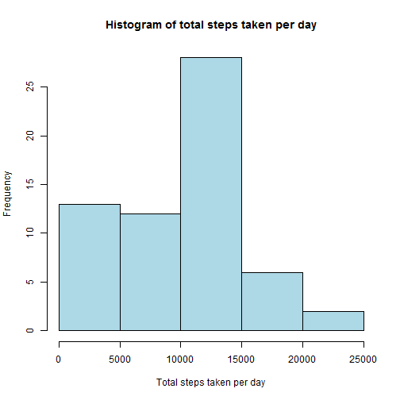
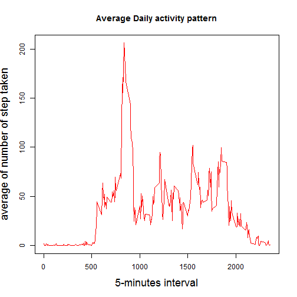
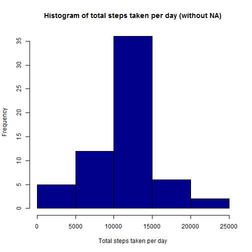

# Reproducible Research: Peer Assessment 1


## Loading and preprocessing the data


```r
#read .csv from zip into data
data <- read.table(unz("activity.zip","activity.csv"),
na.strings="NA",header=T,sep=",",colClasses=c('numeric','character','numeric'))
data$date <- as.Date(data$date)
```

## What is mean total number of steps taken per day?


```r
require(plyr)
```

```
## Loading required package: plyr
```

```r
df <-ddply(data,.(date),summarize,sum=sum(steps,na.rm=T))
```
  
### create histgram  
  

```r
hist(df$sum,xlab="Total steps taken per day",main="Histogram of total steps taken per day",col="lightblue")
```

 
  
### calculate mean and median  
   

```r
m1 <- mean(df$sum)
cat("Mean of total steps taken per day=" , m1, "\n")
```

```
## Mean of total steps taken per day= 9354
```

```r
m2 <- median(df$sum)
cat("Median of total steps taken per day=", m2, "\n")
```

```
## Median of total steps taken per day= 10395
```

## What is the average daily activity pattern?


```r
require(plyr)
df2 <-ddply(data,.(interval),summarize,mean=mean(steps,na.rm=T))
```
### create time series plot


```r
plot(df2$interval,df2$mean,type="l",xlab="",ylab="",col="red")
title(ylab="average of number of step taken",xlab="5-minutes interval",main="Average Daily activity pattern",cex.lab=1.5)
```

 

### find the maximum 

```r
im <- df2[which.max(df2$mean),1]
cat("the 5-minute interval contains maximum number of steps is", im)
```

```
## the 5-minute interval contains maximum number of steps is 835
```

## Inputing missing values

### total number of missing values

```r
na_count <-sum(is.na(data$steps))
cat("totoal number of rows with NAs : ", na_count)
```

```
## totoal number of rows with NAs :  2304
```
### add in missing values


```r
data2 <- data
data2$interval <-as.integer(data2$interval)
# dataset with NA values
head(data2) 
```

```
##   steps       date interval
## 1    NA 2012-10-01        0
## 2    NA 2012-10-01        5
## 3    NA 2012-10-01       10
## 4    NA 2012-10-01       15
## 5    NA 2012-10-01       20
## 6    NA 2012-10-01       25
```
My way of filling in missing values are replacing missing value with mean of that 5-min time interval. I already have a dataframe with all the means and I matched missing value with its 
corresponding mean using "interval". 

```r
#fill missing value with mean of that 5- min time interval
#df2 is the dataframe created with means of each time interval

for(i in 1:nrow(data2)) 
    if(is.na(data2[i,1])) 
        data2[i,1] <- df2$mean[which(as.integer(df2$interval)==data2[i,3])]
# dataset without NA values
head(data2)
```

```
##     steps       date interval
## 1 1.71698 2012-10-01        0
## 2 0.33962 2012-10-01        5
## 3 0.13208 2012-10-01       10
## 4 0.15094 2012-10-01       15
## 5 0.07547 2012-10-01       20
## 6 2.09434 2012-10-01       25
```

```r
na_new <- sum(is.na(data2$steps))
cat("total number of rows with NAs in the new dataset : ", na_new)
```

```
## totoal number of rows with NAs in the new dataset :  0
```

### create histgram based on the dataframe with no NAs.

```r
df3 <-ddply(data2,.(date),summarize,sum=sum(steps,na.rm=T))

hist(df3$sum,xlab="Total steps taken per day",main="Histogram of total steps taken per day (without NA)",col="darkblue")
```

 
   

```r
m3 <- mean(df3$sum)
cat("Mean of total steps taken per day (without NAs)=" , m3, "\n")
```

```
## Mean of total steps taken per day (without NAs)= 10766
```

```r
m4 <- median(df3$sum)
cat("Median of total steps taken per day (without NAs)=", m4, "\n")
```

```
## Median of total steps taken per day (without NAs)= 10766
```

#### with missing value filled in, both mean and median changed.Now that mean and median are the same and larger than before.

## Are there differences in activity patterns between weekdays and weekends?


```r
# a function takes the date as input, determines if it is a weekday or weekend, and returns corresponding string. 
myFunction <- function(x){
    y <- weekdays(x)
    if (y =="Saturday"||y=="Sunday")
    {
        return ("weekend")
    } else{
        return ("weekday")
    }
}
```

### add new col with two factors


```r
require(plyr)

# apply myFunction to date by row and add the returned value to a new column- week.

df4 <- ddply(data2, .(date), transform, week=myFunction(date))
head(df4)
```

```
##     steps       date interval    week
## 1 1.71698 2012-10-01        0 weekday
## 2 0.33962 2012-10-01        5 weekday
## 3 0.13208 2012-10-01       10 weekday
## 4 0.15094 2012-10-01       15 weekday
## 5 0.07547 2012-10-01       20 weekday
## 6 2.09434 2012-10-01       25 weekday
```

### average number of steps taken (weekdays weekend)


```r
#average stpes by interval and week. 
df5 <-ddply(df4,.(interval,week),summarize,mean=mean(steps))

head(df5)
```

```
##   interval    week    mean
## 1        0 weekday 2.25115
## 2        0 weekend 0.21462
## 3        5 weekday 0.44528
## 4        5 weekend 0.04245
## 5       10 weekday 0.17317
## 6       10 weekend 0.01651
```


```r
require(lattice)
```

```
## Loading required package: lattice
```

```r
xyplot(df5$mean~df5$interval|df5$week,type="l",layout=(c(1,2)),
       ylab="Number of steps",xlab="Interval")
```

 
### There is difference in activity between weekdays and weekend based on the graph. 
